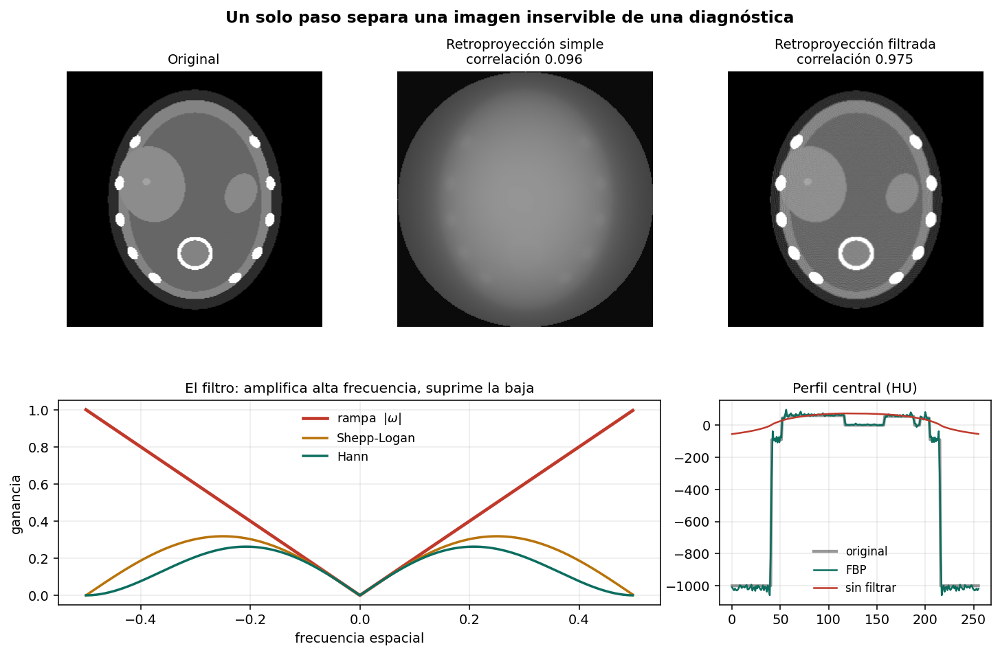
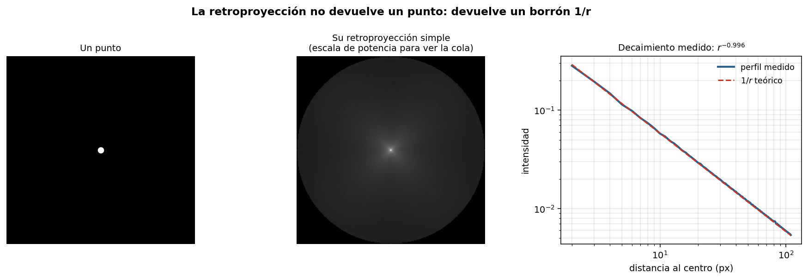
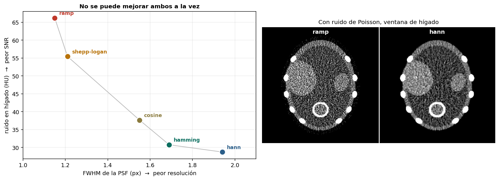

# Retroproyección y el filtro rampa

Por qué la retroproyección simple produce basura, por qué multiplicar por |ω| lo arregla, y
qué se gana y se pierde con cada filtro de reconstrucción.



## Resultado principal

| Método | RMSE (HU) | Correlación |
|---|---|---|
| Retroproyección simple | 220.1 | **0.096** |
| Con filtro rampa | 49.2 | **0.975** |

Correlación 0.096 significa que la imagen prácticamente no guarda relación con el original.
Un solo paso —multiplicar el espectro de cada proyección por |ω|— la lleva a 0.975.

## El problema 1/r, verificado



```
Decaimiento medido: r^(-0.996)
Teoría:             r^(-1)
Error:              0.004
```

La retroproyección es la **transpuesta** de la transformada de Radon, no su inversa. Un
punto vuelve como un borrón que decae como 1/r.

## Por qué el filtro rampa

Por el teorema del corte central, cada proyección aporta una línea radial del espectro 2D de
la imagen. Con ángulos uniformes, esas líneas se apiñan cerca del origen: las bajas
frecuencias quedan sobremuestreadas por un factor 1/|ω|.

Multiplicar por |ω| compensa exactamente ese sesgo.

`src/rampa.py` lo implementa a mano:

```
FBP implementada a mano  : RMSE 49.3 HU
FBP de skimage (ramp)    : RMSE 49.2 HU
```

Detalle de implementación: el relleno con ceros hasta el doble de longitud evita que la FFT
trate la proyección como periódica y contamine los bordes de la imagen.

## Compromiso entre filtros

Con ruido de Poisson realista (I₀ = 3×10⁴ fotones por rayo):

| Filtro | FWHM de la PSF | Ruido en hígado |
|---|---|---|
| ramp | **1.15 px** | 64.4 HU |
| shepp-logan | 1.21 px | 53.6 HU |
| cosine | 1.55 px | 35.8 HU |
| hamming | 1.69 px | 28.9 HU |
| hann | 1.94 px | **26.9 HU** |



De `ramp` a `hann`: resolución 69% peor, ruido 58% mejor. No hay filtro óptimo, hay una
elección clínica. Por eso un tomógrafo reconstruye el mismo sinograma con varios filtros y
entrega varias series — sin dosis adicional.

## Contenido

```
notebooks/ct_fbp_rampa.ipynb   Notebook completo, ejecutable sin datos externos
src/fantoma.py                 Corte abdominal en unidades Hounsfield
src/rampa.py                   Filtro rampa implementado desde cero
figuras/                       Figuras generadas
```

## Reproducir

```bash
git clone https://github.com/USUARIO/ct-fbp-rampa.git
cd ct-fbp-rampa
pip install -r requirements.txt
jupyter lab notebooks/ct_fbp_rampa.ipynb
```

## Limitaciones

La rampa amplifica ruido sin límite en teoría; en la práctica la banda está acotada por el
muestreo del detector.

El ruido modelado es solo de Poisson. Falta el ruido electrónico, que domina cuando la señal
es muy baja (detrás de estructuras densas).

FBP es analítica. Los equipos modernos usan reconstrucción iterativa (ASIR, IMR, ADMIRE),
que modela la estadística del ruido y permite reducir dosis a igual calidad.

La FWHM se mide en el centro del campo; la resolución de un CT se degrada hacia la
periferia.

## Referencias

- Bracewell R.N., Riddle A.C. *Inversion of fan-beam scans in radio astronomy.* Astrophysical Journal, 1967.
- Ramachandran G.N., Lakshminarayanan A.V. *Three-dimensional reconstruction from radiographs and electron micrographs.* PNAS, 1971.
- Shepp L.A., Logan B.F. *The Fourier reconstruction of a head section.* IEEE Trans. Nuclear Science, 1974.
- Kak A.C., Slaney M. *Principles of Computerized Tomographic Imaging.* IEEE Press, 1988.

## Licencia

MIT — ver [LICENSE](LICENSE).
